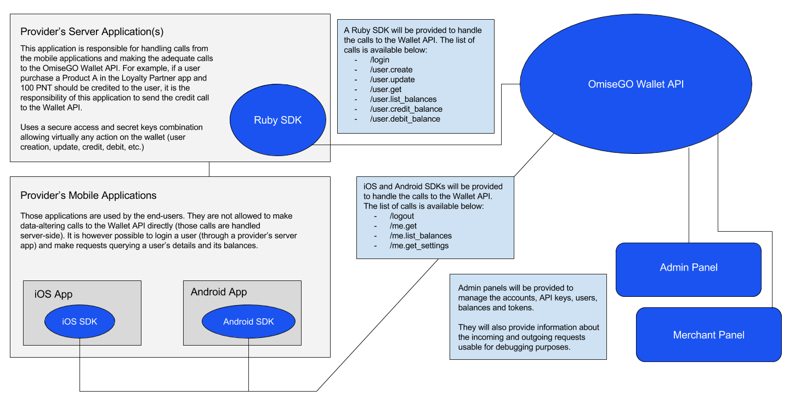
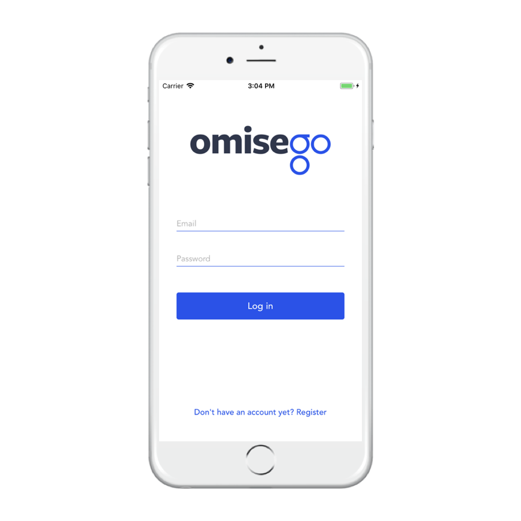

OmiseGO eWallet
===============

The OmiseGO SDK provides various applications and tools that, once integrated, allow any person or company to set up an eWallet with a node of the OmiseGO blockchain. A person or company setting up the OmiseGO SDK in such a way is called a **provider**.

# Table of Contents

- [OmiseGO SDK Overview](#omisego-sdk-overview)
- [OmiseGO SDK Integration Diagram](#omisego-sdk-integration-diagram)
- [Quick Start](#quick-start)
  - [Sample Setup](#sample-setup)
  - [Setting Up the OmiseGO SDK in local](#setting-up-the-omisego-sdk-in-local)
  - [Deploying the OmiseGO SDK](#deploying-the-omisego-sdk)
- [Understanding the server-side applications](#understanding-the-server-side-applications)
  - [Entities](#entities)
  - [Components](#components)
    - [eWallet](#ewallet)
    - [Admin Panel](#admin-panel)
    - [Request Logger](#request-logger)
    - [Blockchain Gateway](#blockchain-gateway)
  - [Dependencies](#dependencies)
- [Communicating with the server applications](#communicating-with-the-server-applications)
  - [HTTP](#http)
  - [Server SDKs](#server-sdks)
  - [Client SDKs](#client-sdks)
- [Integrating the OmiseGO SDK](#integrating-the-omisego-sdk)
  - [Responsibilities](#responsibilities)
- [Diving further](#diving-further)
- [Contributing](#contributing)

# OmiseGO SDK Overview

The OmiseGO SDK is composed of different components that can be grouped in the three following categories:

- __Server Applications__: A set of Elixir applications allowing a provider to store users and their balances, as well as initiating transactions between them and the provider’s balances. Those applications need to be deployed on a server and integrated by the provider through the provided HTTP API.
- __Server and client SDKs__: To facilitate the communication with the server applications, OmiseGO provides language-specific SDKs to integrate both on the server side (for sensitive requests) and on the client side (for non-sensitive requests).
- __Blockchain__: Once the server applications are plugged on the blockchain, the setup will become a node of the decentralized OmiseGO network and allow inter-wallet transactions to happen.

While all of these are being developed simultaneously, they have not all reach the same stage of advancement, which is why the OmiseGO SDK is not actually plugged to the blockchain yet. For now, it acts as a silo-ed eWallet handling loyalty points. Once the blockchain is plugged, those loyalty points will become actual tradable cryptocurrencies.

__The sections below describe the server applications and server/client SDKs provided as part of the OmiseGO SDK.__

# OmiseGO SDK Integration Diagram

Here’s an overview of all the components and what needs to be integrated  by a provider (and how):



# Quick Start

## Sample Setup

OmiseGO has built a sample setup to show how the OmiseGO SDK can be integrated. It is a simple t-shirt store allowing users to receive loyalty points when buying something. They can then use those loyalty points to get a discount.



The code and documentation are available in the following repositories:

- [Server integration (Ruby)](https://github.com/omisego/sample-server)
- [Mobile Server integration (iOS)](https://github.com/omisego/sample-ios)
- [Mobile Server integration (Android)](https://github.com/omisego/sample-android)

## Setting up the OmiseGO SDK in local

To set up the OmiseGO SDK in local, follow the steps below:

1. Install the [dependencies](#dependencies)

2. Install [Elixir](http://elixir-lang.github.io/install.html)

3. Once you have installed the [dependencies](#dependencies) and they are running, it's time to pull the code for the eWallet.

Let's start by cloning the eWallet, getting the dependencies and migrating the database:

```
git clone git@github.com:omisego/ewallet.git && cd ./ewallet
```

```
mix deps.get
```

Before we start the application, let's try running the tests:

```
MIX_ENV=test mix do ecto.create, ecto.migrate
```

```
mix test
```

If everything looks fine, we can create the development database:

```
mix do ecto.create, ecto.migrate
```

Everything is in place and we can now run the seeds to have some data to play with. The following command will insert some sample data in the eWallet database and initiate the genesis for the minted tokens.

```
mix run apps/ewallet/priv/repo/seeds.exs
```

We can now start the application:

```
mix run --no-halt
```

Navigate to  `http://localhost:4000/api` in your browser and you should see the following JSON representation popping up:

```
{
  "success": true,
  "services": {
    "local_ledger": true,
    "ewallet": true
  }
}
```

All set! Start playing around with the API using the Swagger docs below to learn more about the available endpoints. Enjoy!

- [eWallet API](/apps/ewallet_api/swagger-doc.yaml)
- [Admin API](/apps/admin_api/swagger-doc.yaml)

## Environment Variables

### General

Below are the general environment variables needed for the eWallet to run smoothly.

- `MIX_ENV`: Environment in which the application is being ran. `prod` for production.
- `BASE_URL`: The base to use when building URLs.
- `PORT`: The port that the application listens on.
- `EWALLET_SECRET_KEY`: Encryption key used to encrypt some data in the database.
- `LOCAL_LEDGER_SECRET_KEY`: Encryption key used to encrypt some data in the database.

Tip: How to generate a new secret key using Elixir:

```
$ mix run -e "IO.puts Salty.SecretBox.generate_key()"
8I_xIED7p7ruxxM1vNiWzsud3DALk0cnpcAncC2YyMs
```

### Database

The eWallet needs access to two different databases: one for the eWallet itself and one for the local ledger. The following environment variables needs to be set.

- `DATABASE_URL`
- `DATABASE_PASSWORD`
- `LOCAL_LEDGER_DATABASE_URL`
- `LOCAL_LEDGER_DATABASE_PASSWORD`

### Error Reporting

The eWallet only supports Sentry for now. You can specify the DSN for it with the following environment variable:

- `SENTRY_DSN`

### Balance Caching

The local ledger offers a caching mechanism for balances in order to boost the calculation speed (in case you have millions of transactions). To enable this feature, set the `BALANCE_CACHING_FREQUENCY` environment variable and pass it a valid CRON schedule. Note that this is totally optional and the application will work fine without it.

- `BALANCE_CACHING_FREQUENCY`: A valid CRON schedule.

Examples:

- Every minute:         `"* * * * *"`
- Every day at 2 am:    `"0 2 * * *"`
- Every Friday at 5 am: `"0 5 * * 5"`

If this feature is enabled, you can also specify a caching strategy.

- `BALANCE_CACHING_STRATEGY`: Specify if new cached balances should be computed using a previous cache or by recalculating everything from scratch.

Strategies available:

- `since_beginning`: Recalculate the balance since the beginning of time.
- `since_last_cached`: Use the last cached balance, adds the transactions that happened since and saves the result in a new cached balance.

### File Upload

- `FILE_STORAGE_ADAPTER`: (`local`|`aws`|`gcs`, defaults to `local`)

In order to use the file upload feature (for profile pictures and account logos), environment variables need to be defined.

#### Local File Storage

Nothing else to set, files will be stored at the root of the project in `public/uploads/`.

#### Amazon S3

- `AWS_BUCKET`: The name of your S3 bucket.
- `AWS_REGION`: The region in which your bucket lives.
- `AWS_ACCESS_KEY_ID`: Your AWS access key.
- `AWS_SECRET_ACCESS_KEY`: Your AWS secret key.

#### Google Cloud Storage

- `GCS_BUCKET`: Your GCS bucket.
- `GCS_CREDENTIALS`: A JSON containing your GCS credentials.

## Deploying the OmiseGO SDK

OmiseGO offers hosting solutions for the OmiseGO SDK. [Get in touch](mailto:thibault@omise.co) if you're interested.

Deploying the OmiseGO SDK can be done on any infrastructure. For security reasons, it is recommended to run the applications on one server and the databases on a different one.

More information about deployment will be available soon.

# Understanding the server-side applications

In order to integrate the OmiseGO SDK in the best possible way, it can be useful to know how it works. In this section, we'll explore the different entities that make up the OmiseGO server-side applications, then go through the applications themselves and how they interact together. We'll also go over the dependencies needed to run those applications before talking about the deployment steps.

## Entities

- __Minted Tokens__: A currency (loyalty points, cryptocurrency, tokenized fiat). Identified by a symbol (OMG, BTC, USDT). By default, a token is not backed by the blockchain, which means a provider can only make internal transfers: between the provider's balances and the users balances (back and forth) or between accounts. If a provider wishes to have one of its token backed, the address of the smart contract on the blockchain needs to be defined in the token details to uniquely identify it.

- __Mints__: A record of each occurrence when more tokens were put into circulation.

- __Accounts__: A grouping of users and balances. It can be used by a provider admin to define logical groupings according to its business needs, e.g. an account for each product branding, each store branch, each sales team or each operating region, etc.

- __Users__: A user can either be a regular user or a staff user (a.k.a admin) In the first case, it would be someone using the end-user applications created by providers (mobile applications for example), who was added to the eWallet database by the provider. In the second case, it's a user able to access the OmiseGO admin panel.

- __Balances__: A balance identified by an address which is used to group transactions and holds a value. A user can have more than one balance if needed, and a balance can contain different currencies. You can learn more about balances [there](/docs/balances.md).

- __Transactions__: A transaction is an exchange of value between two balances. Transactions are stored in the local ledger using a DEB approach. DEB (Double Entry Bookkeeping) is a system where an entry is created and DEBIT/CREDIT transactions are linked to it. The sum of all debits minus the sum of all credits for a specific entry has to be equal to 0. Summing up all credit transactions minus all debit transactions for a specific balance address and token symbol gives the balance of that address.

- __Access Key__: An identifying pair of keys (access/secret) used by a provider's server application to communicate with eWallet. A combination is used here instead of a single key to prevent timing- based attacks.

- __Secret Key__: A secret key acting as a password and sent from a provider's backend application to authenticate requests.

- __API Key__: A perishable key sent from a mobile applications to make authenticated non-sensitive API calls to eWallet.

- __Access Token__: A temporary token generated by the eWallet API and returned through a provider's backend application to the client. It can then be used with an API key to make non-sensitive calls to eWallet.

## Components

Below is the list of components from the OmiseGO SDK that need to be run on one (or more) server(s):

- [eWallet](#ewallet)
- [Admin Panel](#admin-panel)
- [Request Logger](#request-logger)
- [Blockchain Gateway](#blockchain-gateway)

### eWallet

The eWallet is the centerpiece of the OmiseGO SDK. Through the web APIs it offers, the eWallet can be used to create users and balances, and exchange values between them. The eWallet also contains entities that can be used to configure, organize and manage the eWallet (accounts, minted tokens, etc.). The web APIs offered by the eWallet follow an HTTP-RPC approach. They do not follow the REST recommendations to stay as protocol-agnostic as possible.

The eWallet contains the Local Ledger which is an internal ledger used by the eWallet application to record transactions. No integration is needed from the provider for this tool, but it can be useful to know that the transactions are stored in a different database.

**Note that the exchange of value (the transactions) is delegated to the local ledger.**

On a more technical note, the eWallet is an umbrella Elixir application containing the following sub-applications:

  - [ewallet](/apps/ewallet): Sub-application containing the business logic (minting process, transfer of value, etc.).

  - [ewallet_api](/apps/ewallet_api): Sub-application acting as a gateway to the World Wide Web through HTTP-RPC endpoints. These endpoints are used to __interact with the eWallet__. Check the [Swagger spec](/apps/ewallet_api/swagger-doc.yaml) for more details.

  - [admin_api](/apps/admin_api): Sub-application acting as a gateway to the World Wide Web through HTTP-RPC endpoints. These endpoints are used to __manage__ the system. Check the [Swagger spec](/apps/admin_api/swagger-doc.yaml) for more details.

  - [ewallet_db](/apps/ewallet_db): Sub-application containing all the database schemas and migrations.

  - [local_ledger](/apps/local_ledger): Sub-application containing the business logic.

  - [local_ledger_db](/apps/local_ledger_db): Sub-application containing all the database schemas and migrations.

### Admin Panel

Admin Panel allows provider’s admin, i.e. staff at the headquarter, to perform system-wide actions such as managing tokens, accounts, API keys, users, and balances.

### Request Logger

**Final name still to be defined - Coming Soon.**

The Request Logger will offer details about each request made to the system, its current state and any error that occurred. It will be a powerful debugging tool for developers. Those logs will be available through the eWallet Admin API and shown in the admin panel.

### Blockchain Gateway

**Final name still to be defined - Coming Soon.**

The Blockchain Gateway will be the interface to the blockchain OmiseGO is building. It will push transactions to the blockchain as well as listen to events happening there before forwarding them to the eWallet to keep it in sync.

## Dependencies

- [PostgreSQL](https://www.postgresql.org/): PostgreSQL is used to store most of the data for the eWallet API and local ledger.

- [ImageMagick](https://www.imagemagick.org/script/index.php): ImageMagick is used to format images in the admin panel.

- [Libsodium](https://github.com/jedisct1/libsodium): Sodium is a new, easy-to-use software library for encryption, decryption, signatures, password hashing and more. It is used to hash and encrypt/decrypt sensitive data.

# Communicating with the server applications

The OmiseGO offers HTTP-RPC web APIs for communication. To make things easier to integrate, we've also created server-side and client-side SDKs wrapping those HTTP requests.

### HTTP

If you wish to use the HTTP-RPC web APIs directly, here are the Swagger specifications containing all the available endpoints and how to interact with them.

- [eWallet API](/apps/ewallet_api/swagger-doc.yaml)
- [Admin API](/apps/admin_api/swagger-doc.yaml)

### Server SDKs

To implement the sensitive calls on your side (such as crediting or debiting tokens from/to a user), we currently have the following server-side SDKs available:

- [Ruby SDK](https://github.com/omisego/ruby-sdk)

### Client SDKs

For the client side (non-sensitive calls), we currently have the following mobile SDKs available:

- [iOS SDK](https://github.com/omisego/ios-sdk)
- [Android SDK](https://github.com/omisego/android-sdk)

# Integrating the OmiseGO SDK

Integrating the OmiseGO SDK requires a new setup to be deployed. Feel free to [get in touch](mailto:thibault@omise.co) for that step as we offer hosted solutions. Before starting any integration, it is important to understand which responsibilities OmiseGO is taking care of and which ones you will need to implement.

## Responsibilities

### Features provided by the SDK

|Area of responsibilities|Tasks|
|------------------------|-----|
|Token management   | - Create loyalty tokens <br> - Put more loyalty tokens in circulation <br> - Remove loyalty tokens from circulation <br> - Provide user interface for creating new loyalty tokens <br> - Provide user interface for add/remove of loyalty tokens from circulation|
|Secondary user store|- Create users along with their token balances. The user stored in the Wallet API is solely for identifying and transacting with the user’s token balances.|
|Token transactions|- Perform credit/debit of loyalty tokens to/from users|
|Entity management|- Create, update and list accounts<br>- Create, update and list users with their balances<br>- Assign and unassign roles to users in an account<br>- Assign and unassign permissions to roles|
|API management|- Generate and invalidate access and secret keys (for server application)<br>- Generate and invalidate API keys (for mobile application)|
|Transactions|- List all transactions and their credit/debit entries|
|Payment request|- Generate payment requests with QR code|
|Payment inquiry|- List pending payments<br>- List successful payments|
|Notifications|- Notify merchant panel user of new successful payments|

### Provider's side

|Side|Area of responsibilities|Tasks|
|----|------------------------|-----|
|Server|User management|- Create and safely store end-user data<br>- Send user creation requests to eWallet API (only to interact with their balances)<br>- Maintain the immutable user identifier (provider_user_id) to identify a user in eWallet API|
|Server|Mobile app authentication|- Authenticate mobile application user<br>- Request authentication tokens from eWallet API and send to the client application|
|Server|Transactions (read/write)|- Perform credit and debit calls to eWallet API<br>- Perform all other data-changing operations with eWallet API|
|Mobile   |User management   |  - Register new user with the server application<br>- Send user data updates to the server application|
|Mobile   |User authentication   | - Authenticate user with the server application<br>- Retrieve and store eWallet API’s authentication token from the server application|
|Mobile   |Transactions (read-only)  | - Retrieve user balances from the eWallet API<br>- Retrieve the list of settings including supported tokens.<br>- All data-changing operations cannot be performed by the mobile application|

# Diving further

- [A closer look at balances](/docs/balances.md)

# Contributing

Coming soon.
