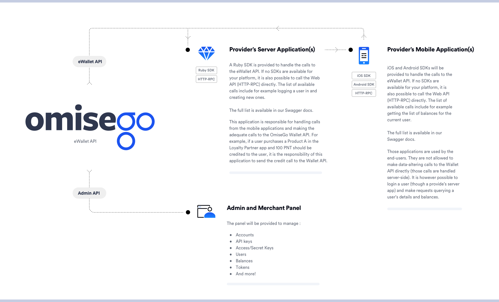
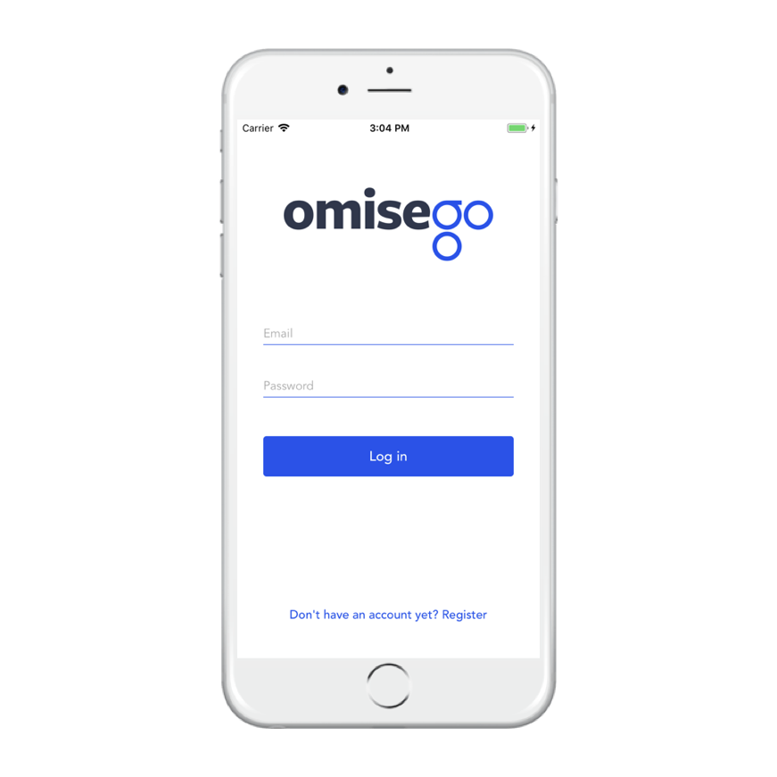

# OmiseGO eWallet

The OmiseGO eWallet is an Elixir application freely available for anyone who wishes to run a (local) ledger through a web interface.

**The eWallet will later be plugged to a blockchain and connected to a decentralized exchange. All the eWallets will then become a federated network forming the top layer of the OMG network, allowing the exchange of any currency into any other in a transparent way.**

**In the rest of this document, a person or company setting up this eWallet is called a provider.**

# Disclaimer

## Beta

The OmiseGO eWallet and SDKs are still under heavy development, and therefore, in "beta". This means things might break or change suddenly. We are moving fast, and until the official release, we'd like to keep it that way.

**Use at your own risk.**

(Still, we will do our best to keep breaking changes to the minimum and notify when such events happen)

## Blockchain

Do not expect to find anything related to blockchain integration **yet**. It will come, when it's ready.

# Table of Contents

-   [Introduction](#introduction)
-   [OmiseGO SDK Integration Diagram](#omisego-sdk-integration-diagram)
-   [Sample Setup](#sample-setup)
-   [Getting Started](#getting-started)
-   [Deploying the OmiseGO eWallet](#deploying-the-omisego-ewallet)
-   [Coming Soon](#coming-soon)
-   [F.A.Q](#faq)
-   [Going Further](#going-further)
-   [Contributing](#contributing)
-   [License](#license)

# TL;DR

Stable: The latest stable release of the eWallet.

Current (a.k.a staging): The most up-to-date version of the eWallet. We work with this version every day, so things might break.

**The URLs below are OmiseGO testing and sample eWallets. The eWallet is not a centralized service and no one should actually use those in production.**

<<<<<<< HEAD
-   eWallet Web API Docs: [stable](https://ewallet.demo.omisego.io/api/docs) / [current](https://ewallet.staging.omisego.io/api/docs)

-   Admin Web API Docs: [stable](https://ewallet.demo.omisego.io/admin/api/docs) / [current](https://ewallet.staging.omisego.io/admin/api/docs)
=======
- eWallet Web API Docs: [stable](https://ewallet.demo.omisego.io/api/client/docs) /  [current](https://ewallet.staging.omisego.io/api/client/docs)

- Admin Web API Docs: [stable](https://ewallet.demo.omisego.io/api/admin/docs) / [current](https://ewallet.staging.omisego.io/api/admin/docs)
>>>>>>> Refactor API path

-   SDKs:

    -   [Ruby](https://github.com/omisego/ruby-sdk)
    -   [iOS](https://github.com/omisego/ios-sdk)
    -   [Android](https://github.com/omisego/android-sdk)

-   Sample Apps:
    -   [Server integration (Ruby)](https://github.com/omisego/sample-server)
    -   [Mobile integration (iOS)](https://github.com/omisego/sample-ios)
    -   [Mobile integration (Android)](https://github.com/omisego/sample-android)

# Introduction

What is commonly called as the OmiseGO SDK is actually composed of a few different applications.

-   **eWallet**: Currently only acting as local ledger (as opposed to a decentralized one), it will later on be plugged on a blockchain with minimal changes required for providers. The eWallet needs to be deployed on a server.
-   **Server and client SDKs**: To simplify the communication with the eWallet, OmiseGO provides language-specific SDKs.

Currently, the easiest use-case to understand what the eWallet can do is to see it as a loyalty point ledger. Once the blockchain is plugged, those points will become actual tradable cryptocurrencies.

# OmiseGO SDK Integration Diagram

Here’s an overview of all the components and what needs to be integrated by a provider (and how):



# Sample Setup

OmiseGO has built a sample setup to demonstrate how the OmiseGO eWallet and the SDKs can be used. It is a simple t-shirt store allowing users to receive loyalty points when buying something. They can then use those loyalty points to get a discount.



The code and documentation are available in the following repositories:

-   [Server integration (Ruby)](https://github.com/omisego/sample-server)
-   [Mobile Server integration (iOS)](https://github.com/omisego/sample-ios)
-   [Mobile Server integration (Android)](https://github.com/omisego/sample-android)

The demo server applications have been deployed and are available at the following URLs:

-   [OMGShop - Ruby on Rails](https://sample-shop.demo.omisego.io/)
-   [OMGShop - eWallet](https://ewallet.demo.omisego.io/)

# Getting Started

The following section will get you up to speed on the eWallet and show you how to deploy it in local.

## Using Docker image

We provides a Docker image for quick installation at the [omisego/ewallet](https://hub.docker.com/r/omisego/ewallet/) repository on Docker Hub with the following tags:

-   `latest` tracks current (i.e. develop branch)
-   `stable` tracks stable (i.e. master branch)

Additionally, all commits in develop and master branches are also built. It is highly recommended to pin the version to specific commit in anything that resembles production environment. An easiest way to get the Docker image running would be (assuming [PostgreSQL](https://hub.docker.com/_/postgres/) is already setup):

```
$ docker run \
    -e DATABASE_URL="postgresql://postgres@127.0.0.1:5432/ewallet" \
    -e LOCAL_LEDGER_DATABASE_URL="postgresql://postgres@127.0.0.1:5432/local_ledger" \
    -p 4000:4000 \
    omisego/ewallet:latest
```

Then run `docker exec <container-id> mix do ecto.create, ecto.migrate` to setup the database.

## Quick installation with Goban

If you don't want to set up everything from scratch with the instructions below, you can use [Goban](https://github.com/omisego/goban) instead. Goban will generate a consistent development environment within a virtual machine for you without having to install the dependencies manually.

Once Goban is set up successfully, you can access your development environment by running the command `vagrant ssh`, then skip directly to [Setting up](#setting-up).

## Installing the dependencies

Be sure to have the following applications installed and running on your machine.

-   [PostgreSQL](https://www.postgresql.org/): PostgreSQL is used to store most of the data for the eWallet API and local ledger.

-   [ImageMagick](https://www.imagemagick.org/script/index.php): ImageMagick is used to format images in the admin panel. Tested with version `> 7.0.7-22`.

-   [Elixir](http://elixir-lang.github.io/install.html): Elixir is a dynamic, functional language designed for building scalable and maintainable applications.

-   [Git](https://git-scm.com/): Git is a free and open source distributed version control system designed to handle everything from small to very large projects with speed and efficiency.

## Getting the code

Once you have installed the all the dependencies and they are running, it's time to pull the eWallet code. To do so, let's use `git`:

```
git clone https://github.com/omisego/ewallet && cd ./ewallet
```

Feel free to look around!

## Setting up

We now need to pull the Elixir dependencies:

```
$ mix deps.get
```

Then get the front-end dependencies:

```
$ cd apps/admin_panel/assets/ && yarn install
```

If you are setting up without Goban, you may need to set some environment variables before proceeding. You can use `export ENV=value` to set environment variables in the current session (or you can add them to whatever profile file you're using).

**It is important to understand that the eWallet actually connects to two different databases. The first one, the local ledger database, is only used to store transactions, making it easier for audits. The second one contains, well, everything else.**

In development, you should only have to set the `DATABASE_URL` and `LOCAL_LEDGER_DATABASE_URL` if your local PostgreSQL installation requires authentication.

-   `DATABASE_URL`: The URL where the main database can be accessed. Defaults to `postgres://localhost/ewallet_dev` in `dev`, `postgres://localhost/ewallet_test` in `test`.
-   `LOCAL_LEDGER_DATABASE_URL`: The URL where the ledger database can be accessed. Defaults to `postgres://localhost/local_ledger_dev` in `dev`, `postgres://localhost/local_ledger_test` in `test`.

The `ewallet_dev` and `local_ledger_dev` don't need to be created beforehand as long as the database URLs contain credentials allowing this kind of operations.

In some cases, you might also want to customize the following ones, depending on your development setup:

-   `BASE_URL`: The URL where the application can be accessed. Defaults to `http://localhost:4000`.
-   `PORT`: The internal listening port for the application. Default to `4000`.

To learn more about all the environment variables available for production deployments (or if you want to get fancy in local), checkout [this doc](/docs/setup/env.md).

## Running the tests

Before we start the application, let's try running the tests. Create the test databases:

```
$ MIX_ENV=test mix do ecto.create, ecto.migrate
```

Or if you're using specific database URLs:

```
$ MIX_ENV=test DATABASE_URL=postgres://localhost/ewallet_test_db LOCAL_LEDGER_DATABASE_URL=postgres://localhost/local_ledger_test_db mix do ecto.create, ecto.migrate
```

**If you don't want to do that, you can always search & replace the default values in the config files, but only do that in development to give it a try - we really don't recommend changing the code that way for production setups.**

Then, let's run the tests:

```
$ mix test
```

Or:

```
$ DATABASE_URL=postgres://localhost/ewallet_test_db LOCAL_LEDGER_DATABASE_URL=postgres://localhost/local_ledger_test_db mix test
```

```
==> local_ledger_db
Finished in 0.5 seconds
57 tests, 0 failures

==> ewallet_db
Finished in 2.3 seconds
249 tests, 0 failures

==> local_ledger
Finished in 0.9 seconds
24 tests, 0 failures

==> ewallet
Finished in 3.4 seconds
141 tests, 0 failures

==> admin_api
Finished in 4.4 seconds
184 tests, 0 failures

==> ewallet_api
Finished in 4.5 seconds
134 tests, 0 failures
```

All the tests should pass. If some tests are failing, double-check you have install all the dependencies. If you keep getting the failures, you can get in touch with us on [Gitter](https://gitter.im/omisego/ewallet)!

## Migrating the development database

If all the tests passed, we can create the development databases:

```
$ mix do ecto.create, ecto.migrate
```

## Inserting some data

Everything is in place and we can now run the seeds to populate the eWallet database with some initial data:

```
$ mix seed
```

**Note: The command above seeds the minimum amount of data to get the environment up and running. To play in development environment with some sample data, run `mix seed --sample` instead.**

## Booting up

Time to start the application!

```
$ mix omg.server
```

Navigate to `http://localhost:4000/api` in your browser and you should see the following `JSON` representation popping up:

```
{
  "success": true,
  "services": {
    "local_ledger": true,
    "ewallet": true
  }
}
```

You can also access the Admin Panel web interface via `http://localhost:4000/admin` using
the credentials provided during the seed.

All set! Start playing around with the API using the Swagger UI below to learn more about the available endpoints. Enjoy!

## Web APIs Interactive Documentation

-   Admin API: [http://localhost:4000/api/admin/docs](http://localhost:4000/api/admin/docs)
-   eWallet API: [http://localhost:4000/api/client/docs](http://localhost:4000/api/client/docs)

## Making your first requests

Here are some steps to get you started with the fun, they can all be performed by accessing the Swagger UI linked above:

1.  In the Admin API, configure the authentication at the top using the keys generated in the seeding step.
2.  Log yourself in and get the returned authentication token. In case you're getting an invalid auth scheme, double check that you're using `OMGAdmin` with the base64 encoded version of `API_KEY_ID:API_KEY` (with no `\n`, some programming languages add them).
3.  Configure the user authentication using the authentication token you've received in the previous step.
4.  Create a token using `/token.create`. You can specify the optional `amount` parameter to do an initial minting.
5.  After that you're ready to start messing around with the eWallet API. You can create yourself a user using one of the server calls and credit/debit tokens!

## Communicating with the eWallet

If Swagger UI is not enough, you can start communicating with the web APIs using any programming language of your choice, either by using the HTTP-RPC endpoints directly or by using one of the available SDKs.

### HTTP-RPC WEB APIs

If you wish to use the HTTP-RPC web APIs directly, here are the OpenAPI specifications containing all the available endpoints and how to interact with them. You can access those interactive documentations on any running eWallet application, including the ones you deploy yourself! The eWallet API docs live under `/api/client/docs` and the Admin API ones under `/api/admin/docs`.

<<<<<<< HEAD
-   [eWallet API](https://ewallet.demo.omisego.io/api/docs)
-   [Admin API](https://ewallet.demo.omisego.io/admin/api/docs)
=======
- [eWallet API](https://ewallet.demo.omisego.io/api/client/docs)
- [Admin API](https://ewallet.demo.omisego.io/api/admin/docs)
>>>>>>> Refactor API path

When using the eWallet API, be sure to have `/api` at the end of your base URL (e.g. `https://yourdomain.com/api/client`). For the Admin API, it should include `/api/admin` (e.g. `https://yourdomain.com/api/admin`).

### Server SDKs

To implement the sensitive calls in your server-side applications (such as crediting or debiting tokens from/to a user), the following SDKs are available:

-   [Ruby SDK](https://github.com/omisego/ruby-sdk)

### Client SDKs

For client-side applications (non-sensitive calls), the following SDKs are available:

-   [iOS SDK](https://github.com/omisego/ios-sdk)
-   [Android SDK](https://github.com/omisego/android-sdk)

### Not seeing what you need?

If none of the current SDKs matches your needs, you can create it! Get in touch with us [on Gitter](https://gitter.im/omisego/ewallet) and let us know. We'll be happy to help you implement it and, if your SDK meets our standards, support it as one of our official SDK.

# Deploying the OmiseGO eWallet

OmiseGO offers hosting solutions for the OmiseGO SDK. [Get in touch](mailto:thibault@omisego.co) if you're interested.

Deploying the OmiseGO SDK can be done on any infrastructure. For security reasons, it is recommended to run the applications on one server and the databases on a different one.

More information about deployment will be available soon.

# Contributing

In order for the build to pass, the following commands must run successfully without errors:

-   `mix format --check-formatted`
-   `mix credo`
-   `mix dialyzer`
-   `mix test`

# Coming Soon

In this section, we will be sharing some of the next features the OmiseGO team will be working on.

-   Better environment variables management for `test` and `dev` environments.
-   Finalize the transaction requests mechanism allowing QR code transfers.
-   Re-design and finalize the first version of the Admin Panel.
-   Implement the Request Logger sub-app for easier logging and debugging.
-   Refactor and split the factories files. Make smarter use of them throughout the tests.
-   Refactor and unify the test helpers for minting.
-   ...

# Support

-   Got an idea to improve the SDKs? Talk to us in [Gitter](https://gitter.im/omisego/ewallet)'s `omisego/ewallet` room

-   Found a bug? File an issue with [GitHub Issues](https://github.com/omisego/ewallet/issues).

-   Stuck at integrating or building on top of the SDKs? Search or create a question on StackOverflow using the tag [omisego](https://stackoverflow.com/questions/tagged/omisego).

# Upgrading

## Encryption Upgrade

Please note that starting June 19, 2018, we've switched the encryption scheme for metadata to AES-GCM rather than relying on libsodium. If you have existing data from previous releases, you must first upgrade the encryption scheme. This can be done in the following steps:

1.  Replace environment variable for encryption keys:

    -   Existing `EWALLET_SECRET_KEY` should be renamed to `RETIRED_EWALLET_SECRET_KEY`.
    -   Existing `LOCAL_LEDGER_SECRET_KEY` should be renamed to `RETIRED_LOCAL_LEDGER_SECRET_KEY`.

2.  Generate a new key with the following command:

    ```
    $ elixir -e "IO.puts 32 |> :crypto.strong_rand_bytes() |> Base.encode64()"
    ```

3.  Put the key in environment variables:

    -   `EWALLET_SECRET_KEY` for the new eWallet secret key.
    -   `LOCAL_LEDGER_SECRET_KEY` for the new local ledger secret key.

4.  Run the following command to migrate database and encryption keys:

    ```
    $ mix ecto.migrate
    $ mix omg.migrate.encryption
    ```

# F.A.Q

##### Can I use the eWallet right now?

Sure! You can deploy it on a server (or run it locally) and start using it as a ledger. Refer to the [getting started](#getting-started) section for more information.

##### When will the eWallet be official released (out of Beta)?

When it's ready :) Feel free to follow the progress through PRs, issues and our monthly updates for more information.

##### Can I help?

Of course! Check out our [contribution guidelines](.github/CONTRIBUTING.md) to get started.

##### Why going with HTTP-RPC vs RESTful?

We decided to stay as protocol-agnostic as possible and not follow HTTP conventions. Therefore, the web APIs only allows the `POST` method and returns `200` or `500` codes with custom representations and errors.

##### Is the eWallet a centralized service?

Each provider is responsible for running its own version of the eWallet. To get started, we offer hosting solutions but the long term goal is to have a federated network of eWallets running on top of a decentralized blockchain with no centralization.

More questions? Get in touch with us on [Gitter](https://gitter.im/omisego/ewallet)!

# Going Further

Here are some resources if you want to learn more about how the eWallet works.

-   [Database schemas](/docs/design/databases.md)
-   [All ENV needed to run the eWallet](/docs/setup/env.md)
-   [Integration Responsibilities](/docs/setup/integration.md)
-   [eWallet Entites](/docs/design/entities.md)
-   [eWallet Components](/docs/design/components.md)
-   [A closer look at wallets](/docs/design/wallets.md)

# Contributing

See [how you can help](.github/CONTRIBUTING.md).

# License

The OmiseGO eWallet is released under the [Apache License](https://www.apache.org/licenses/LICENSE-2.0).
